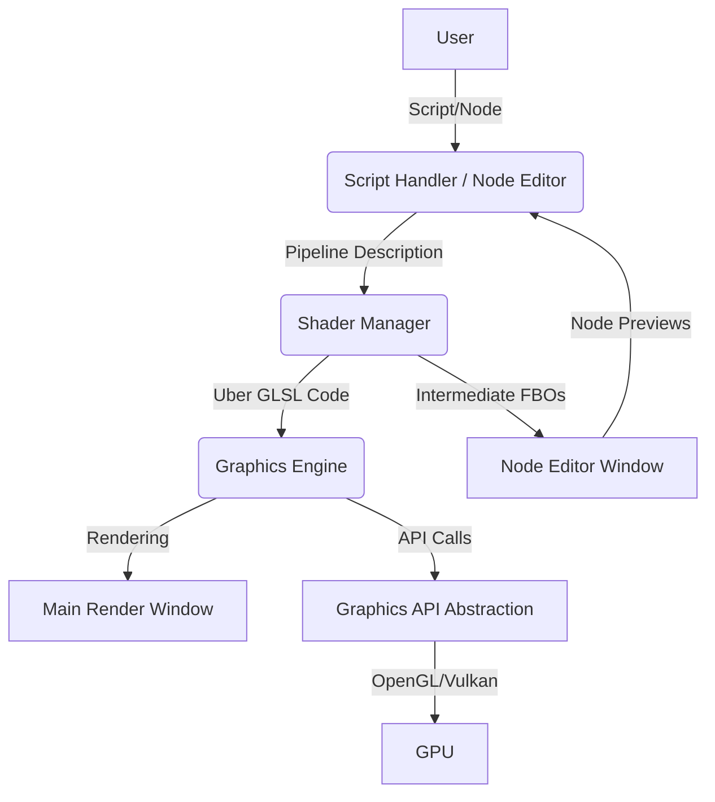
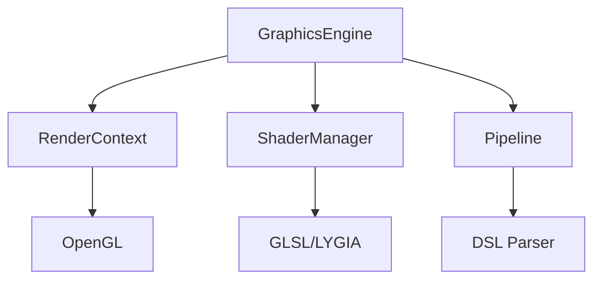

# Graphics Engine Project Overview

## Vision

이 프로젝트는 SuperCollider의 구조를 모방하여, 엔진(Engine)과 인터프리터(Interpreter)를 분리한 모듈형 실시간 그래픽 파이프라인 툴을 목표로 합니다. DSL(도메인 특화 언어)과 노드 기반 GUI를 통해, 사용자는 AngelScript(엔젤스크립트)로 작성된 스크립트 또는 노드 에디터(Node Editor)를 통해 실시간으로 GLSL 기반의 Uber Shader(우버 셰이더)를 생성하고, 다양한 그래픽 효과를 실험할 수 있습니다.

---

## Architecture (아키텍처)



---

## Main Interface & Synchronization (메인 인터페이스 및 동기화)

이 어플리케이션의 메인 인터페이스는 AngelScript(엔젤스크립트)로 작성된 코드 파일입니다. 사용자가 이 파일을 수정하면, 그래픽 엔진(Graphics Engine)이 이를 감지하여 파이프라인을 즉시 수정합니다. 만약 노드 에디터(Node Editor)가 실행 중이라면, 노드의 연결 구조도 엔젤스크립트 코드에 맞게 자동으로 동기화됩니다. 반대로, 사용자가 노드 에디터에서 노드를 조작하면, 이에 맞춰 그래픽 파이프라인과 엔젤스크립트 코드 파일 역시 자동으로 갱신됩니다. 즉, 스크립트와 노드 에디터는 양방향 실시간 동기화가 이루어집니다.

---

## Module Breakdown (모듈 구성)

### 1. 그래픽 엔진(Graphics Engine)
- **OpenGL 4.1 Core Profile 지원**: 크로스 플랫폼 호환성(macOS 포함) 보장, 향후 컴퓨트 셰이더 지원 시 상위 버전 확장 가능
- **OpenGL 컨텍스트 생성 및 관리(OpenGL Context Creation & Management)**
- **셰이더 렌더링(Shader Rendering)**
- **PIMPL 패턴**: 구현 세부사항 캡슐화로 컴파일 시간 단축 및 ABI 안정성 확보
- **모듈형 아키텍처**: RenderContext, ShaderManager, Pipeline 분리로 각 구성요소 독립적 관리
- 미래에는 Vulkan 등 다양한 Graphics API(그래픽 API)로 확장 가능하도록 설계

### 2. 셰이더 매니저(Shader Manager)
- **우버 GLSL 코드 생성(Uber GLSL Code Generation)**: 사용자 입력(스크립트/노드)에 따라 LYGIA GLSL 라이브러리에서 필요한 코드 조합
- **셰이더 핫리로딩(Shader Hot-Reloading)**: 실시간 GLSL 코드 교체 및 컴파일
- **모듈 시스템(Module System)**: 각 Generator/Operator(제네레이터/오퍼레이터)를 함수 단위로 모듈화

### 3. 노드 에디터(Node Editor)
- **ImGui Node Editor 기반 GUI**
- **노드 기반 파이프라인 편집(Node-based Pipeline Editing)**: 각 노드는 Generator/Operator(제네레이터/오퍼레이터)에 대응
- **Intermediate FBO 렌더링(Intermediate FBO Rendering)**: 각 노드별로 작은 크기의 FBO(Frame Buffer Object)에 렌더링, 실시간 미리보기 제공
- **별도 윈도우에서 동작(Separate Window)**: 메인 렌더 윈도우와 별도의 창에서 동작

### 4. 스크립트 핸들러/호스트 API(Script Handler / Host API)
- **AngelScript 연동(AngelScript Integration)**: AngelScript(엔젤스크립트)를 C++에 이식하여 DSL로 사용
- **스크립트 감시 및 핫리로딩(Script Watching & Hot-Reloading)**: 외부 텍스트 파일의 변경 감지 및 자동 반영
- **스크립트 컴파일 및 실행(Script Compilation & Execution)**: AngelScript의 언어 기능을 그래픽 파이프라인에 맞게 해석 및 변환

### 5. 그래픽 API 추상화 레벨(Graphics API Abstraction Layer)
- **OpenGL/Vulkan 추상화(OpenGL/Vulkan Abstraction)**: 향후 Vulkan 등 다양한 API로의 확장성 확보
- **현재 구현(Current Implementation)**: 현재는 OpenGL만 지원, 추후 확장 예정

---

## Workflow (작업 흐름)

1. **User**는 AngelScript(엔젤스크립트) 기반 DSL 파일을 작성하거나, 노드 에디터(Node Editor)에서 그래픽 파이프라인을 구성합니다.
2. **스크립트 핸들러(Script Handler)** 또는 **노드 에디터(Node Editor)** 는 파이프라인 정보를 **셰이더 매니저(Shader Manager)** 에 전달합니다.
3. **셰이더 매니저(Shader Manager)** 는 필요한 LYGIA GLSL 모듈을 조합하여 우버 셰이더(Uber Shader)를 생성합니다.
4. **그래픽 엔진(Graphics Engine)** 은 우버 셰이더를 GPU에 업로드하고, 실시간 렌더링을 수행합니다.
5. **노드 에디터(Node Editor)** 가 활성화된 경우, 각 노드별로 Intermediate FBO(Frame Buffer Object)를 생성하여 미리보기를 제공합니다.
6. **그래픽 API 추상화 레벨(Graphics API Abstraction Layer)**은 향후 다양한 그래픽 API로의 확장을 지원합니다.

---
---

## Project Structure (프로젝트 구조)

```text
graphicsEngine-clean2/
├── src/                    # Source code
│   └── graphics/          # Graphics engine modules
├── shaders/               # GLSL shader files
│   ├── modules/          # Reusable shader modules
│   ├── default.frag      # Default fragment shader
│   └── passthrough.vert  # Default vertex shader
├── examples/              # Example applications
│   ├── shader_manager_demo.cpp
│   └── main_test_node_editor.cpp
├── tests/                 # Test files and utilities
│   ├── manual_test_guide.py
│   └── README.md
├── scripts/               # Build and utility scripts
├── external/              # External dependencies (LYGIA, etc.)
├── build/                 # Build output (generated)
└── CMakeLists.txt         # Build configuration
```

---

## Future Directions (향후 발전 방향)

- **Vulkan 등 다양한 Graphics API(그래픽 API) 지원**
- **AngelScript DSL의 그래픽 파이프라인 친화적 확장**
- **노드 에디터(Node Editor)의 고도화 및 사용자 경험 개선**
- **멀티 플랫폼 지원 및 성능 최적화**
- **실시간 협업/공유 기능 등 확장성 고려**

---

## Technical Specifications (기술 사양)

### Graphics API Requirements (그래픽 API 요구사항)
- **OpenGL Version (OpenGL 버전)**: 4.1 Core Profile (macOS 호환)
- **Future Extensibility (향후 확장성)**: 컴퓨트 셰이더 및 고급 기능을 위한 상위 버전 업그레이드 가능
- **Cross-Platform Support (크로스 플랫폼 지원)**: Windows, macOS, Linux

### Code Documentation Standards (코드 문서화 표준)
모든 코드는 포괄적인 문서화 표준을 따릅니다:

#### Function Documentation (함수 문서화)
```cpp
/**
 * @brief 함수 목적에 대한 간략한 설명
 * @param paramName 매개변수 설명
 * @return 반환값 설명
 * @tparam T 템플릿 매개변수 설명 (해당되는 경우)
 */
```

#### Class Documentation (클래스 문서화)
```cpp
/**
 * @brief 클래스의 목적과 주요 책임
 * 
 * 시스템에서 클래스 역할에 대한 상세 설명
 */
class ClassName {
    int memberVar;          ///< 멤버 변수에 대한 간략한 설명
    // ...
};
```

### Architecture Patterns (아키텍처 패턴)
- **PIMPL (Pointer to Implementation)**: 컴파일 속도와 ABI 안정성을 위해 GraphicsEngine에서 사용
- **RAII (Resource Acquisition Is Initialization)**: 스마트 포인터를 통한 자동 리소스 관리
- **Factory Pattern (팩토리 패턴)**: DSL 설명으로부터 파이프라인 생성
- **Observer Pattern (관찰자 패턴)**: 윈도우 이벤트를 위한 콜백 시스템

### Module Dependencies (모듈 의존성)


---

> 본 문서는 프로젝트의 아키텍처와 개발 방향성을 명확히 하기 위해 작성되었습니다. 실제 구현 단계에서 세부 구조와 모듈은 변경될 수 있습니다.
