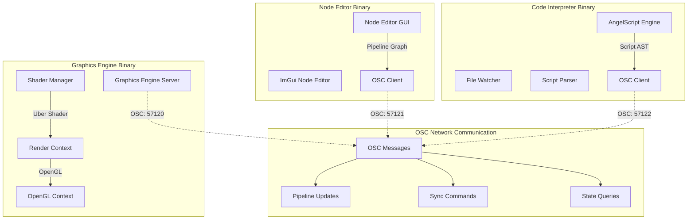
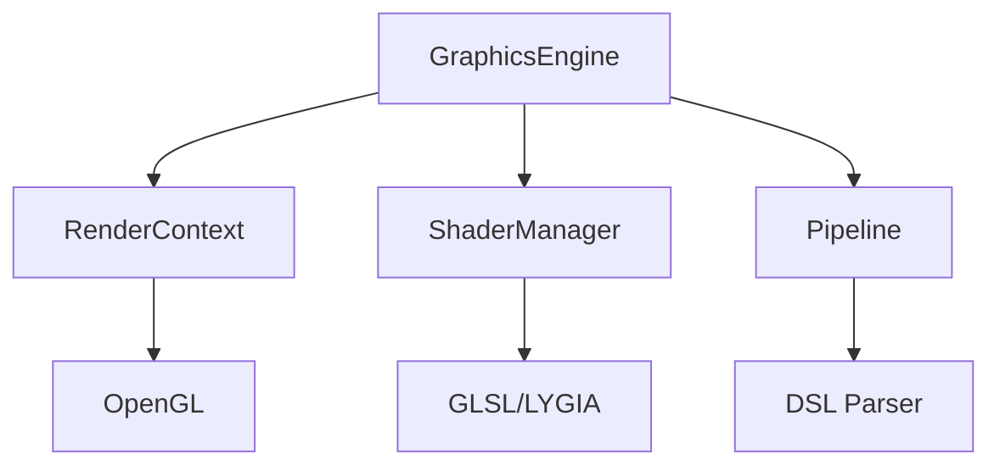

# Graphics Engine Project Overview

## Vision

이 프로젝트는 SuperCollider의 구조를 모방하여, 세 개의 독립적인 바이너리(Engine, Node Editor, Code Interpreter)로 분리된 모듈형 실시간 그래픽 파이프라인 툴을 목표로 합니다. OSC(Open Sound Control) 프로토콜을 통해 통신하며, DSL(도메인 특화 언어)과 노드 기반 GUI를 통해 사용자는 AngelScript(엔젤스크립트)로 작성된 스크립트 또는 노드 에디터(Node Editor)를 통해 실시간으로 GLSL 기반의 Uber Shader(우버 셰이더)를 생성하고, 다양한 그래픽 효과를 실험할 수 있습니다.

---

## Distributed Architecture (분산 아키텍처)



### Binary Communication Flow
- **Graphics Engine**: OSC 서버 (기본: localhost:57120)
- **Node Editor**: OSC 클라이언트 (송신: localhost:57121)  
- **Code Interpreter**: OSC 클라이언트 (송신: localhost:57122)

---

## Main Interface & Synchronization (메인 인터페이스 및 동기화)

이 어플리케이션의 메인 인터페이스는 세 개의 독립적인 바이너리로 구성됩니다:

1. **Graphics Engine**: OSC 서버로 동작하며, 렌더링 파이프라인을 관리하고 실제 그래픽 출력을 담당
2. **Code Interpreter**: AngelScript 파일의 변경을 감지하고, 스크립트를 파싱하여 OSC를 통해 Graphics Engine에 파이프라인 업데이트를 전송
3. **Node Editor**: 노드 기반 GUI를 제공하며, 사용자 조작을 OSC 메시지로 변환하여 Graphics Engine에 전송

모든 동기화는 OSC 프로토콜을 통해 이루어지며, 각 바이너리는 독립적으로 실행/종료가 가능합니다. 사용자가 스크립트 파일을 수정하거나 노드를 조작하면, 해당 변경사항이 즉시 OSC를 통해 Graphics Engine에 전달되어 실시간으로 파이프라인이 업데이트됩니다.

---

## Binary Breakdown (바이너리 구성)

### 1. Graphics Engine Binary (그래픽 엔진 바이너리)

- **OSC 서버**: liblo 기반 OSC 서버로 동작 (기본 포트: 57120)
- **OpenGL 4.1 Core Profile 지원**: 크로스 플랫폼 호환성(macOS 포함) 보장, 향후 컴퓨트 셰이더 지원 시 상위 버전 확장 가능
- **OpenGL 컨텍스트 생성 및 관리**: GLFW 기반 윈도우 및 컨텍스트 관리
- **셰이더 렌더링**: 실시간 GLSL 코드 컴파일 및 렌더링
- **PIMPL 패턴**: 구현 세부사항 캡슐화로 컴파일 시간 단축 및 ABI 안정성 확보
- **모듈형 아키텍처**: RenderContext, ShaderManager, Pipeline 분리로 각 구성요소 독립적 관리
- **OSC 메시지 처리**: 파이프라인 업데이트, 셰이더 파라미터 변경, 상태 쿼리 등

### 2. Node Editor Binary (노드 에디터 바이너리)

- **ImGui Node Editor 기반 GUI**: 독립적인 GLFW 윈도우에서 실행
- **OSC 클라이언트**: liblo 기반 OSC 클라이언트로 Graphics Engine과 통신
- **노드 기반 파이프라인 편집**: 각 노드는 Generator/Operator에 대응
- **실시간 미리보기**: Graphics Engine으로부터 중간 렌더링 결과 수신 및 표시
- **양방향 동기화**: 노드 조작 시 OSC를 통해 Graphics Engine 및 Code Interpreter와 동기화

### 3. Code Interpreter Binary (코드 인터프리터 바이너리)

- **AngelScript 엔진**: AngelScript 파일 파싱 및 AST 생성
- **파일 와처**: 스크립트 파일 변경 감지 및 자동 리로드
- **OSC 클라이언트**: liblo 기반 OSC 클라이언트로 Graphics Engine과 통신
- **DSL 파싱**: 사용자 정의 그래픽 파이프라인 스크립트를 파이프라인 그래프로 변환
- **CLI 인터페이스**: 명령줄 기반 스크립트 실행 및 디버깅

### 4. Shader Manager (셰이더 매니저)

- **우버 GLSL 코드 생성**: OSC 메시지로 받은 파이프라인 그래프를 LYGIA GLSL 라이브러리 기반 셰이더 코드로 변환
- **셰이더 핫리로딩**: 실시간 GLSL 코드 교체 및 컴파일
- **모듈 시스템**: 각 Generator/Operator를 함수 단위로 모듈화
- **LYGIA 통합**: 동적 include 및 의존성 해결

### 5. OSC Communication Layer (OSC 통신 레이어)

- **liblo 기반**: 크로스 플랫폼 OSC 라이브러리 사용
- **메시지 타입**: 파이프라인 업데이트, 파라미터 변경, 상태 쿼리, 동기화 명령
- **에러 핸들링**: 네트워크 오류, 메시지 파싱 오류 등 robust 처리
- **설정 가능한 주소/포트**: 각 바이너리의 OSC 주소와 포트를 런타임에 설정 가능

---

## 의존성 및 설치 (Dependencies and Installation)

### 시스템 요구사항 (System Requirements)

- **운영체제**: Linux (Ubuntu 20.04+, Fedora 35+, Arch Linux), macOS 12+, Windows 10+
- **그래픽카드**: OpenGL 4.1+ 호환 그래픽카드 및 드라이버
- **메모리**: 병렬 빌드를 위해 2GB+ RAM 권장
- **저장공간**: 의존성 및 빌드 산출물을 위해 1GB+ 여유 공간

### 필수 시스템 의존성 (Required System Dependencies)

대부분의 의존성은 자동으로 소스에서 다운로드 및 빌드되지만, **liblo**는 LGPL 준수를 위해 시스템 차원에서 설치해야 합니다(동적 링킹 요구사항).

#### Ubuntu/Debian
```bash
sudo apt-get update
sudo apt-get install build-essential cmake pkg-config
sudo apt-get install liblo-dev libgl1-mesa-dev libx11-dev
```

#### Fedora/RHEL/CentOS
```bash
sudo dnf install gcc-c++ cmake pkg-config
sudo dnf install liblo-devel mesa-libGL-devel libX11-devel
```

#### Arch Linux
```bash
sudo pacman -S base-devel cmake pkg-config
sudo pacman -S liblo mesa libx11
```

#### macOS
```bash
# Xcode Command Line Tools 설치
xcode-select --install

# Homebrew가 설치되지 않은 경우 설치
/bin/bash -c "$(curl -fsSL https://raw.githubusercontent.com/Homebrew/install/HEAD/install.sh)"

# 의존성 설치
brew install cmake pkg-config liblo
```

#### Windows (vcpkg)
```powershell
# Visual Studio 2019+ with C++ tools 설치
# CMake 설치 및 PATH에 추가

# vcpkg 설치
git clone https://github.com/Microsoft/vcpkg.git
cd vcpkg
.\bootstrap-vcpkg.bat

# liblo 설치
.\vcpkg install liblo:x64-windows
```

### 자동 다운로드 의존성 (Automatically Downloaded Dependencies)

다음 의존성들은 CMake 빌드 과정에서 자동으로 소스에서 다운로드 및 빌드됩니다:

- **GLFW 3.3.8**: 윈도우 관리 및 OpenGL 컨텍스트 생성
- **GLEW 2.2.0**: OpenGL 확장 로딩  
- **ImGui 1.90.1**: 즉시 모드 GUI 프레임워크
- **ImGui Node Editor**: 시각적 노드 그래프 편집
- **AngelScript 2.38.0**: 스크립팅 엔진
- **OpenGL Headers**: 모던 OpenGL API 정의

### 빌드 방법 (Build Instructions)

```bash
# 저장소 클론
git clone https://github.com/oudeis01/graphicsEngine
cd graphicsEngine

# 빌드 디렉토리 생성
mkdir build && cd build

# 구성 및 빌드 (의존성 자동 다운로드)
cmake ..
make -j$(nproc)  # Linux/macOS
# 또는
cmake --build . --config Release  # Windows
```

### 문제 해결 (Troubleshooting)

#### liblo를 찾을 수 없음
```bash
# 오류: "liblo not found. Please install liblo development package"
# 해결책: 위에서 설명한 패키지 매니저를 사용하여 liblo 설치
```

#### OpenGL 오류
```bash
# 오류: OpenGL context creation failed
# 해결책: 그래픽 드라이버 업데이트
# NVIDIA: 최신 nvidia 드라이버 설치
# AMD: 최신 mesa 또는 amdgpu 드라이버 설치  
# Intel: 최신 mesa 드라이버 설치
```

#### X11 오류 (Linux)
```bash
# 오류: X11 libraries not found
# 해결책: X11 개발 패키지 설치
sudo apt-get install libx11-dev libxrandr-dev libxinerama-dev libxcursor-dev libxi-dev
```

---

## OSC Communication Workflow (OSC 통신 워크플로우)

### 1. 시스템 시작 (System Startup)

1. **Graphics Engine Binary**를 먼저 실행 (OSC 서버로 동작)
2. **Node Editor Binary** 또는 **Code Interpreter Binary** (또는 둘 다) 실행
3. 각 클라이언트가 Graphics Engine의 OSC 서버에 연결
4. 초기 상태 동기화 수행

### 2. 스크립트 기반 워크플로우 (Script-based Workflow)

1. **사용자**가 AngelScript 파일을 작성/수정
2. **Code Interpreter**가 파일 변경을 감지하고 스크립트를 파싱
3. **Code Interpreter**가 OSC 메시지를 통해 파이프라인 그래프를 Graphics Engine에 전송
4. **Graphics Engine**의 **Shader Manager**가 LYGIA 기반 우버 셰이더를 생성
5. **Graphics Engine**이 셰이더를 컴파일하고 실시간 렌더링 수행
6. **Node Editor**가 실행 중이면 OSC를 통해 노드 그래프를 자동 동기화

### 3. 노드 기반 워크플로우 (Node-based Workflow)

1. **사용자**가 Node Editor에서 노드를 추가/연결/수정
2. **Node Editor**가 OSC 메시지를 통해 파이프라인 변경사항을 Graphics Engine에 전송
3. **Graphics Engine**이 파이프라인을 업데이트하고 렌더링 수행
4. **Code Interpreter**가 실행 중이면 OSC를 통해 AngelScript 파일을 자동 업데이트
5. **Node Editor**가 Graphics Engine으로부터 중간 렌더링 결과를 수신하여 노드별 미리보기 표시

### 4. OSC 메시지 타입 (OSC Message Types)

```
/pipeline/update        - 파이프라인 그래프 업데이트
/pipeline/node/add      - 노드 추가
/pipeline/node/remove   - 노드 제거
/pipeline/node/connect  - 노드 연결
/pipeline/param/set     - 파라미터 값 설정
/render/request         - 렌더링 요청
/state/sync             - 상태 동기화
/error                  - 에러 메시지
```

### 5. 에러 처리 및 복구 (Error Handling & Recovery)

- OSC 연결 끊김 시 자동 재연결 시도
- 잘못된 파이프라인 그래프 시 이전 상태로 롤백
- 셰이더 컴파일 에러 시 OSC를 통해 클라이언트에 에러 메시지 전송

---
---

## Project Structure (프로젝트 구조)

```text
graphicsEngine/
├── src/                           # Source code
│   ├── graphics/                  # Graphics Engine Binary
│   │   ├── GraphicsEngine.*       # Main graphics engine
│   │   ├── RenderContext.*        # OpenGL context management
│   │   ├── ShaderManager.*        # Uber shader generation
│   │   ├── Pipeline.*             # Pipeline management
│   │   └── OSCServer.*            # OSC server implementation
│   ├── node_editor/               # Node Editor Binary
│   │   ├── NodeEditor.*           # ImGui-based node editor
│   │   ├── NodeGraph.*            # Node graph management
│   │   └── OSCClient.*            # OSC client for Graphics Engine
│   └── code_interpreter/          # Code Interpreter Binary
│       ├── AngelScriptEngine.*    # AngelScript integration
│       ├── FileWatcher.*          # File change detection
│       ├── ScriptParser.*         # DSL parsing
│       └── OSCClient.*            # OSC client for Graphics Engine
├── external/                      # External dependencies
│   ├── lygia/                     # LYGIA GLSL library
│   ├── liblo/                     # OSC communication (via CMake)
│   ├── imgui-node-editor/         # Node editor (via CMake)
│   └── angelscript/               # AngelScript (via CMake)
├── examples/                      # Example scripts and usage
│   ├── scripts/                   # Example AngelScript files
│   ├── shader_manager_demo.cpp    # Legacy demo
│   └── main_test_node_editor.cpp  # Legacy test
├── tests/                         # Test files and utilities
│   ├── osc_test.cpp              # OSC communication tests
│   ├── integration_test.cpp       # Multi-binary integration tests
│   └── README.md
├── scripts/                       # Build and utility scripts
│   ├── run_engine.sh             # Start Graphics Engine
│   ├── run_node_editor.sh        # Start Node Editor
│   └── run_code_interpreter.sh   # Start Code Interpreter
├── build/                         # Build output (generated)
├── CMakeLists.txt                 # Build configuration
└── README.md                      # Project documentation
```

---

## Implementation Roadmap (구현 로드맵)

### Phase 1: OSC Infrastructure (OSC 인프라 구축)

- **liblo 통합**: CMake를 통한 liblo 의존성 추가
- **OSC 서버/클라이언트 래퍼 클래스**: C++ 인터페이스 구현
- **기본 OSC 메시지 프로토콜**: 파이프라인 업데이트, 상태 동기화 등
- **에러 핸들링 및 재연결 로직**: robust 네트워크 통신

### Phase 2: Binary Separation (바이너리 분리)

- **Graphics Engine Binary**: 현재 구현을 OSC 서버 기반으로 리팩터링
- **Node Editor Binary**: ImGui Node Editor 통합 및 OSC 클라이언트 구현
- **Code Interpreter Binary**: AngelScript 통합 및 파일 와처 구현
- **CMake 빌드 시스템**: 세 개의 독립적인 타겟 생성

### Phase 3: Integration & Testing (통합 및 테스트)

- **OSC 통신 테스트**: 바이너리 간 메시지 교환 검증
- **실시간 동기화**: 스크립트-노드-엔진 간 양방향 동기화
- **예제 시나리오**: 다양한 사용 사례에 대한 예제 구현
- **문서화**: 사용자 가이드 및 API 문서 작성

### Phase 4: Advanced Features (고급 기능)

- **Vulkan 지원**: Graphics Engine에 Vulkan 백엔드 추가
- **네트워크 투명성**: 다른 머신에서 실행되는 바이너리 간 통신 지원
- **플러그인 시스템**: 사용자 정의 노드/오퍼레이터 지원
- **협업 기능**: 다중 사용자 실시간 편집 지원

---

## Future Directions (향후 발전 방향)

- **분산 컴퓨팅**: OSC 네트워크를 통한 다중 머신 렌더링 클러스터
- **웹 인터페이스**: 웹 기반 노드 에디터 및 원격 제어
- **VR/AR 지원**: 몰입형 3D 그래픽 파이프라인 편집 환경
- **AI 통합**: 머신러닝 기반 셰이더 최적화 및 파이프라인 제안
- **클라우드 렌더링**: 클라우드 기반 고성능 렌더링 서비스 연동

---

## Technical Specifications (기술 사양)

### Graphics API Requirements (그래픽 API 요구사항)
- **OpenGL Version (OpenGL 버전)**: 4.1 Core Profile (macOS 호환)
- **Future Extensibility (향후 확장성)**: 컴퓨트 셰이더 및 고급 기능을 위한 상위 버전 업그레이드 가능
- **Cross-Platform Support (크로스 플랫폼 지원)**: Windows, macOS, Linux

### Code Documentation Standards (코드 문서화 표준)
모든 코드는 포괄적인 문서화 표준을 따릅니다:

#### Function Documentation (함수 문서화)
```cpp
/**
 * @brief 함수 목적에 대한 간략한 설명
 * @param paramName 매개변수 설명
 * @return 반환값 설명
 * @tparam T 템플릿 매개변수 설명 (해당되는 경우)
 */
```

#### Class Documentation (클래스 문서화)
```cpp
/**
 * @brief 클래스의 목적과 주요 책임
 * 
 * 시스템에서 클래스 역할에 대한 상세 설명
 */
class ClassName {
    int memberVar;          ///< 멤버 변수에 대한 간략한 설명
    // ...
};
```

### Architecture Patterns (아키텍처 패턴)
- **PIMPL (Pointer to Implementation)**: 컴파일 속도와 ABI 안정성을 위해 GraphicsEngine에서 사용
- **RAII (Resource Acquisition Is Initialization)**: 스마트 포인터를 통한 자동 리소스 관리
- **Factory Pattern (팩토리 패턴)**: DSL 설명으로부터 파이프라인 생성
- **Observer Pattern (관찰자 패턴)**: 윈도우 이벤트를 위한 콜백 시스템

### Module Dependencies (모듈 의존성)


---

> 본 문서는 프로젝트의 아키텍처와 개발 방향성을 명확히 하기 위해 작성되었습니다. 실제 구현 단계에서 세부 구조와 모듈은 변경될 수 있습니다.
