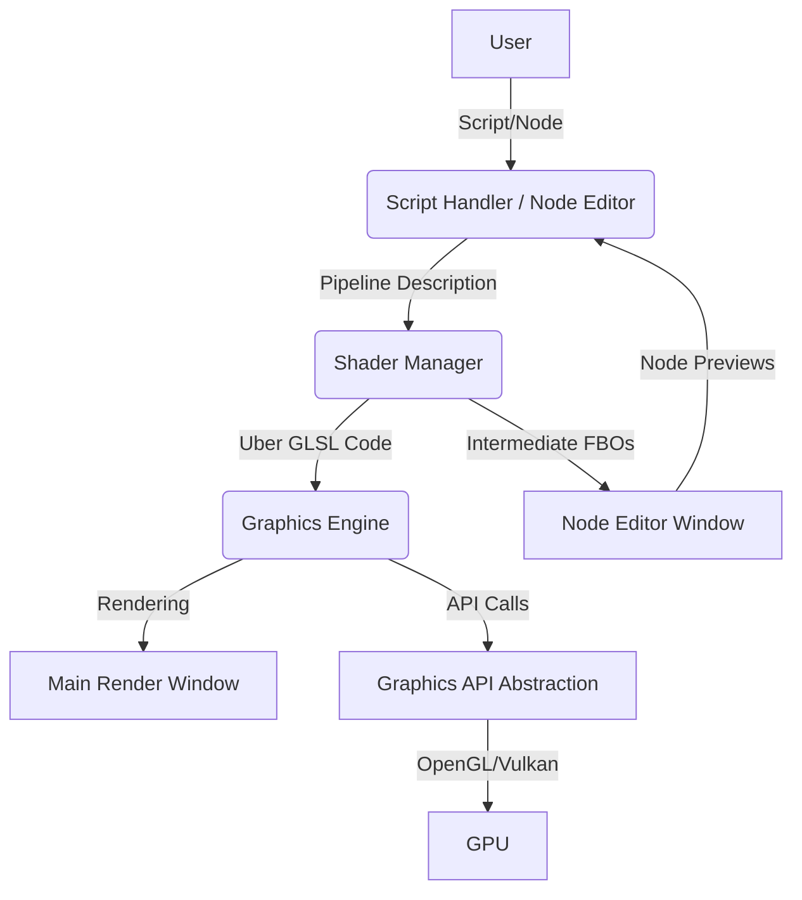
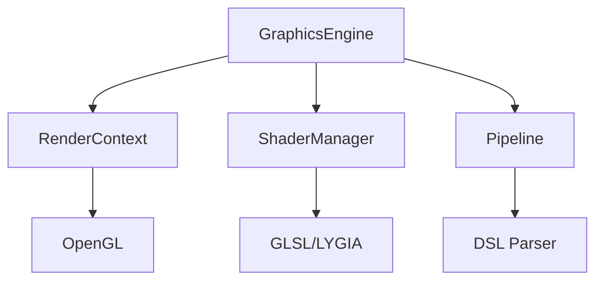

# Graphics Engine Project Overview

## Vision

This project aims to create a modular real-time graphics pipeline tool that mimics SuperCollider's architecture by separating the engine and interpreter. Through DSL (Domain Specific Language) and node-based GUI, users can generate GLSL-based Uber Shaders in real-time and experiment with various graphic effects using scripts written in AngelScript or through a Node Editor.

---

## Architecture



---

## Main Interface & Synchronization

The main interface of this application is a code file written in AngelScript. When users modify this file, the Graphics Engine detects the changes and immediately updates the pipeline. If the Node Editor is running, the node connection structure is automatically synchronized to match the AngelScript code. Conversely, when users manipulate nodes in the Node Editor, the graphics pipeline and AngelScript code file are automatically updated accordingly. In other words, bidirectional real-time synchronization occurs between scripts and the Node Editor.

---

## Module Breakdown

### 1. Graphics Engine
- **OpenGL 4.1 Core Profile Support**: Ensures cross-platform compatibility (including macOS), upgradeable to higher versions for future compute shader support
- **OpenGL Context Creation & Management**: Complete OpenGL context lifecycle management
- **Shader Rendering**: High-performance GLSL shader execution
- **PIMPL Pattern**: Implementation detail encapsulation for faster compilation and ABI stability
- **Modular Architecture**: Independent management of RenderContext, ShaderManager, and Pipeline components
- Future extensibility to various Graphics APIs including Vulkan

### 2. Shader Manager
- **Uber GLSL Code Generation**: Dynamic GLSL code composition from LYGIA library based on user input (scripts/nodes)
- **Shader Hot-Reloading**: Real-time GLSL code replacement and compilation
- **Module System**: Function-level modularization of each Generator/Operator

### 3. Node Editor
- **ImGui Node Editor Based GUI**: Professional node-based interface
- **Node-based Pipeline Editing**: Each node corresponds to Generator/Operator components
- **Intermediate FBO Rendering**: Real-time preview rendering in small FBOs for each node
- **Separate Window Operation**: Operates independently from the main render window

### 4. Script Handler / Host API
- **AngelScript Integration**: AngelScript embedded in C++ as DSL
- **Script Watching & Hot-Reloading**: Automatic detection and reflection of external text file changes
- **Script Compilation & Execution**: Interpretation and conversion of AngelScript language features for graphics pipeline

### 5. Graphics API Abstraction Layer
- **OpenGL/Vulkan Abstraction**: Extensibility for various APIs including Vulkan
- **Current Implementation**: Currently supports OpenGL only, future expansion planned

---

## Workflow

1. **User** creates DSL files based on AngelScript or configures graphics pipeline in the Node Editor
2. **Script Handler** or **Node Editor** passes pipeline information to the **Shader Manager**
3. **Shader Manager** combines necessary LYGIA GLSL modules to generate Uber Shader
4. **Graphics Engine** uploads Uber Shader to GPU and performs real-time rendering
5. When **Node Editor** is active, Intermediate FBOs are created for each node to provide previews
6. **Graphics API Abstraction Layer** supports future expansion to various graphics APIs

---

## Project Structure

```text
graphicsEngine-clean2/
├── src/                    # Source code
│   └── graphics/          # Graphics engine modules
├── shaders/               # GLSL shader files
│   ├── modules/          # Reusable shader modules
│   ├── default.frag      # Default fragment shader
│   └── passthrough.vert  # Default vertex shader
├── examples/              # Example applications
│   ├── shader_manager_demo.cpp
│   └── main_test_node_editor.cpp
├── tests/                 # Test files and utilities
│   ├── manual_test_guide.py
│   └── README.md
├── scripts/               # Build and utility scripts
├── external/              # External dependencies (LYGIA, etc.)
├── build/                 # Build output (generated)
└── CMakeLists.txt         # Build configuration
```

---

## Future Directions

- **Support for Various Graphics APIs** including Vulkan
- **Graphics Pipeline-Friendly Extensions** for AngelScript DSL
- **Advanced Node Editor** with enhanced user experience
- **Multi-Platform Support** and performance optimization
- **Real-time Collaboration/Sharing Features** and extensibility considerations

---

## Technical Specifications

### Graphics API Requirements
- **OpenGL Version**: 4.1 Core Profile (macOS compatible)
- **Future Extensibility**: Upgradeable to higher versions for compute shaders and advanced features
- **Cross-Platform Support**: Windows, macOS, Linux

### Code Documentation Standards
All code follows comprehensive documentation standards:

#### Function Documentation
```cpp
/**
 * @brief Brief description of function purpose
 * @param paramName Description of parameter
 * @return Description of return value
 * @tparam T Template parameter description (if applicable)
 */
```

#### Class Documentation
```cpp
/**
 * @brief Class purpose and main responsibilities
 * 
 * Detailed description of class role in the system
 */
class ClassName {
    int memberVar;          ///< Brief description of member variable
    // ...
};
```

### Architecture Patterns
- **PIMPL (Pointer to Implementation)**: Used in GraphicsEngine for compilation speed and ABI stability
- **RAII (Resource Acquisition Is Initialization)**: Automatic resource management with smart pointers
- **Factory Pattern**: Pipeline creation from DSL descriptions
- **Observer Pattern**: Callback system for window events

### Module Dependencies


---

> This document was created to clarify the project's architecture and development direction. Detailed structures and modules may change during actual implementation phases.
