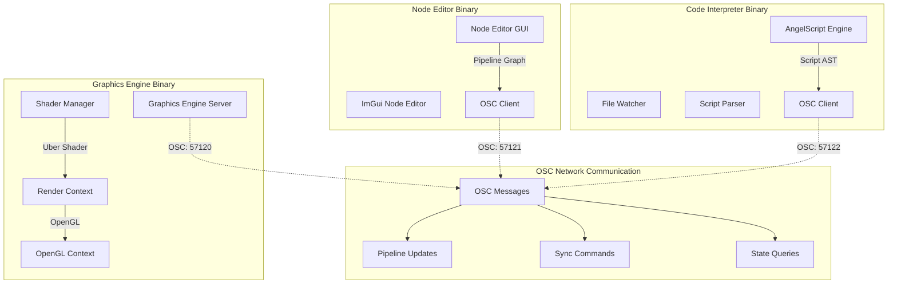
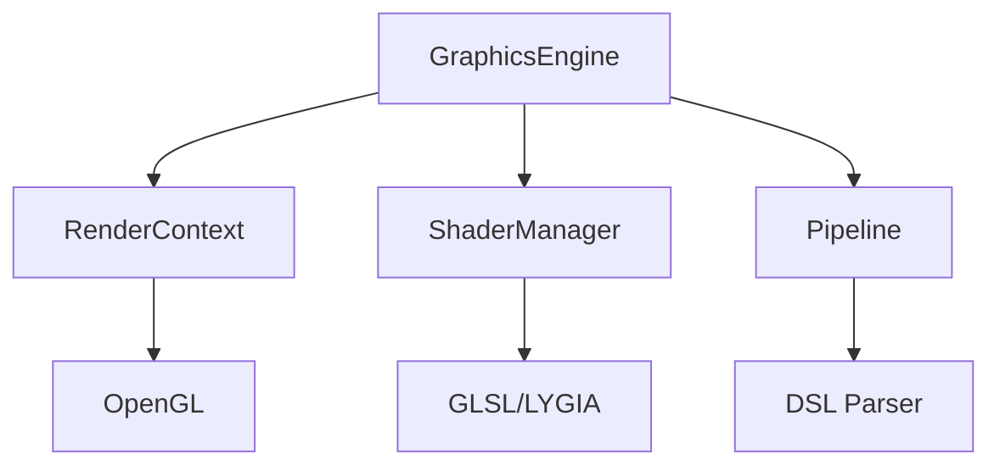

# Graphics Engine Project Overview

> **한글 문서 바로가기**: [PROJECT_OVERVIEW.md](PROJECT_OVERVIEW.md)

## Vision

This project aims to create a modular real-time graphics pipeline tool that mimics SuperCollider's architecture by separating into three independent binaries (Engine, Node Editor, Code Interpreter) communicating via OSC (Open Sound Control) protocol. Through DSL (Domain Specific Language) and node-based GUI, users can generate GLSL-based Uber Shaders in real-time and experiment with various graphic effects using scripts written in AngelScript or through a Node Editor.

---

## Distributed Architecture



### Binary Communication Flow
- **Graphics Engine**: OSC Server (default: localhost:57120)
- **Node Editor**: OSC Client (transmit: localhost:57121)  
- **Code Interpreter**: OSC Client (transmit: localhost:57122)

---

## Main Interface & Synchronization

The main interface of this application consists of three independent binaries:

1. **Graphics Engine**: Acts as an OSC server, manages the rendering pipeline and handles actual graphics output
2. **Code Interpreter**: Detects changes to AngelScript files, parses scripts, and sends pipeline updates to Graphics Engine via OSC
3. **Node Editor**: Provides node-based GUI, converts user manipulations to OSC messages and sends them to Graphics Engine

All synchronization occurs through the OSC protocol, and each binary can be started/stopped independently. When users modify script files or manipulate nodes, changes are immediately transmitted to Graphics Engine via OSC, updating the pipeline in real-time.

---

## Binary Breakdown

### 1. Graphics Engine Binary

- **OSC Server**: liblo-based OSC server (default port: 57120)
- **OpenGL 4.1 Core Profile Support**: Ensures cross-platform compatibility (including macOS), upgradeable to higher versions for future compute shader support
- **OpenGL Context Creation & Management**: GLFW-based window and context management
- **Shader Rendering**: Real-time GLSL code compilation and rendering
- **PIMPL Pattern**: Implementation detail encapsulation for faster compilation and ABI stability
- **Modular Architecture**: Independent management of RenderContext, ShaderManager, and Pipeline components
- **OSC Message Processing**: Pipeline updates, shader parameter changes, state queries, etc.

### 2. Node Editor Binary

- **ImGui Node Editor Based GUI**: Runs in independent GLFW window
- **OSC Client**: liblo-based OSC client communicating with Graphics Engine
- **Node-based Pipeline Editing**: Each node corresponds to Generator/Operator components
- **Real-time Preview**: Receives and displays intermediate rendering results from Graphics Engine
- **Bidirectional Synchronization**: Synchronizes with Graphics Engine and Code Interpreter via OSC when nodes are manipulated

### 3. Code Interpreter Binary

- **AngelScript Engine**: AngelScript file parsing and AST generation
- **File Watcher**: Script file change detection and automatic reload
- **OSC Client**: liblo-based OSC client communicating with Graphics Engine
- **DSL Parsing**: Converts user-defined graphics pipeline scripts to pipeline graphs
- **CLI Interface**: Command-line based script execution and debugging

### 4. Shader Manager

- **Uber GLSL Code Generation**: Converts pipeline graphs received via OSC messages to LYGIA GLSL library-based shader code
- **Shader Hot-Reloading**: Real-time GLSL code replacement and compilation
- **Module System**: Function-level modularization of each Generator/Operator
- **LYGIA Integration**: Dynamic include and dependency resolution

### 5. OSC Communication Layer

- **liblo-based**: Cross-platform OSC library usage
- **Message Types**: Pipeline updates, parameter changes, state queries, synchronization commands
- **Error Handling**: Robust handling of network errors, message parsing errors, etc.
- **Configurable Addresses/Ports**: Runtime configuration of OSC addresses and ports for each binary

---

## OSC Communication Workflow

### System Startup

1. Start **Graphics Engine Binary** first (acts as OSC server)
2. Start **Node Editor Binary** and/or **Code Interpreter Binary** 
3. Each client connects to Graphics Engine's OSC server
4. Perform initial state synchronization

### Script-based Workflow

1. **User** creates/modifies AngelScript files
2. **Code Interpreter** detects file changes and parses scripts
3. **Code Interpreter** sends pipeline graph to Graphics Engine via OSC messages
4. **Graphics Engine's Shader Manager** generates LYGIA-based Uber Shader
5. **Graphics Engine** compiles shader and performs real-time rendering
6. **Node Editor** automatically synchronizes node graph via OSC if running

### Node-based Workflow

1. **User** adds/connects/modifies nodes in Node Editor
2. **Node Editor** sends pipeline changes to Graphics Engine via OSC messages
3. **Graphics Engine** updates pipeline and performs rendering
4. **Code Interpreter** automatically updates AngelScript files via OSC if running
5. **Node Editor** receives intermediate rendering results from Graphics Engine for node previews

### OSC Message Types

```text
/pipeline/update        - Pipeline graph updates
/pipeline/node/add      - Add node
/pipeline/node/remove   - Remove node
/pipeline/node/connect  - Connect nodes
/pipeline/param/set     - Set parameter values
/render/request         - Rendering requests
/state/sync             - State synchronization
/error                  - Error messages
```

---

## Quick Start

### Build and Run

```bash
# Configure and build
cmake -B build
make -C build

# Run all three binaries together (for testing)
make -C build run-all

# Or run individually:
# Graphics Engine (OSC Server on port 57120)
make -C build run-engine

# Node Editor (OSC Client connecting to port 57120)
make -C build run-node-editor

# Code Interpreter (OSC Client connecting to port 57120)
make -C build run-code-interpreter

# Run LYGIA explorer utility
make -C build run-explorer
```

### Requirements

- **CMake 3.15+**: Build system
- **C++17 compiler**: GCC, Clang, or MSVC
- **OpenGL 4.1+**: Graphics API support
- **Linux/macOS/Windows**: Cross-platform support

Dependencies are automatically downloaded via CMake FetchContent:

- **liblo 0.32**: OSC (Open Sound Control) communication library
- **imgui-node-editor**: Node-based visual editor (planned)
- **AngelScript 2.36.1**: Embedded scripting engine (planned)
- **GLFW 3.3.8**: Window management
- **GLEW 2.2.0**: OpenGL extensions
- **LYGIA GLSL Library**: Modular shader functions

---

## Project Structure

```text
graphicsEngine-clean2/
├── src/                    # Source code
│   └── graphics/          # Graphics engine modules
├── shaders/               # GLSL shader files
│   ├── modules/          # Reusable shader modules
│   ├── default.frag      # Default fragment shader
│   └── passthrough.vert  # Default vertex shader
├── examples/              # Example applications
│   ├── shader_manager_demo.cpp
│   └── main_test_node_editor.cpp
├── tests/                 # Test files and utilities
│   ├── manual_test_guide.py
│   └── README.md
├── scripts/               # Build and utility scripts
├── external/              # External dependencies (LYGIA, etc.)
├── build/                 # Build output (generated)
└── CMakeLists.txt         # Build configuration
```

---

## Future Directions

- **Support for Various Graphics APIs** including Vulkan
- **Graphics Pipeline-Friendly Extensions** for AngelScript DSL
- **Advanced Node Editor** with enhanced user experience
- **Multi-Platform Support** and performance optimization
- **Real-time Collaboration/Sharing Features** and extensibility considerations

---

## Technical Specifications

### Graphics API Requirements
- **OpenGL Version**: 4.1 Core Profile (macOS compatible)
- **Future Extensibility**: Upgradeable to higher versions for compute shaders and advanced features
- **Cross-Platform Support**: Windows, macOS, Linux

### Code Documentation Standards
All code follows comprehensive documentation standards:

#### Function Documentation
```cpp
/**
 * @brief Brief description of function purpose
 * @param paramName Description of parameter
 * @return Description of return value
 * @tparam T Template parameter description (if applicable)
 */
```

#### Class Documentation
```cpp
/**
 * @brief Class purpose and main responsibilities
 * 
 * Detailed description of class role in the system
 */
class ClassName {
    int memberVar;          ///< Brief description of member variable
    // ...
};
```

### Architecture Patterns
- **PIMPL (Pointer to Implementation)**: Used in GraphicsEngine for compilation speed and ABI stability
- **RAII (Resource Acquisition Is Initialization)**: Automatic resource management with smart pointers
- **Factory Pattern**: Pipeline creation from DSL descriptions
- **Observer Pattern**: Callback system for window events

### Module Dependencies


---

## License

This project is licensed under the MIT License - see the [LICENSE](LICENSE) file for details.

### Third-Party Components
- **GLFW**: zlib/libpng License
- **GLEW**: Modified BSD License
- **LYGIA**: Prosperity Public License 3.0.0 (commercial use requires separate licensing)

---

> This document was created to clarify the project's architecture and development direction. Detailed structures and modules may change during actual implementation phases.
